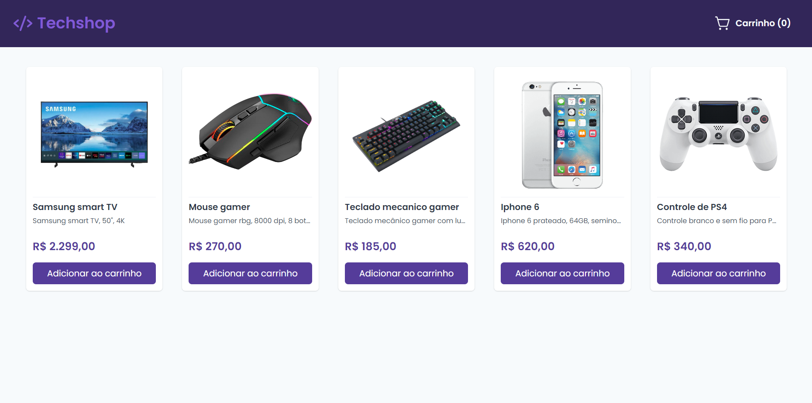
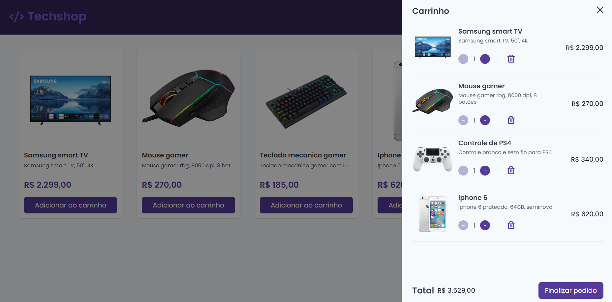
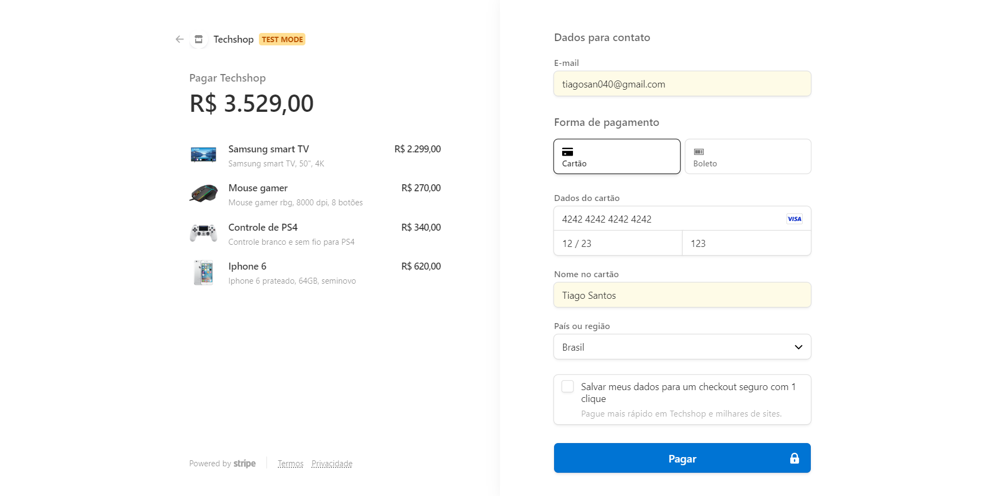
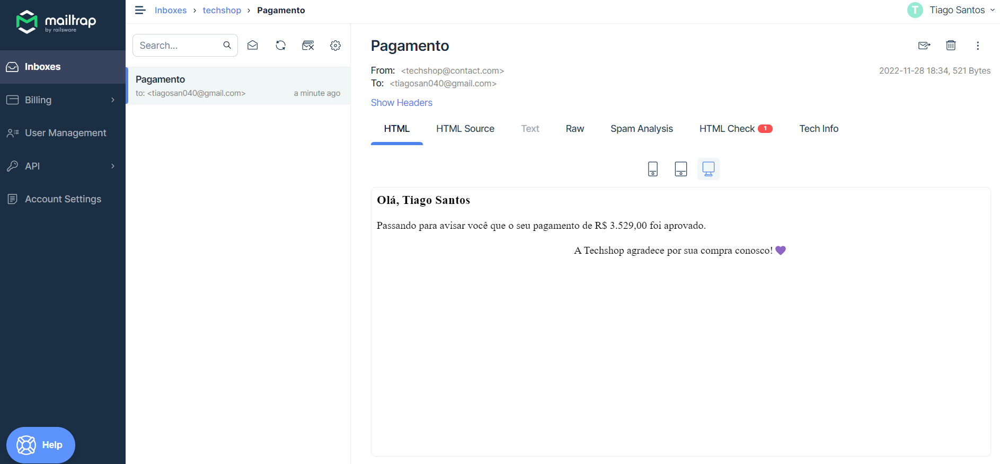

<h1 align="center">Techshop</h1>

<p align="center">
  
  
  <a href="https://github.com/jtiagosantos/techshop/commits/master">
    
  </a>
  
   <a href="https://github.com/jtiagosantos/techshop/stargazers">
    
  </a>
</p>

<h4 align="center"> 
  🚧 Techshop 🛒 Completed 🚀 🚧
</h4>

<p align="center">
  <a href="#-features">Features</a> •
  <a href="#-run-project">Run Project</a> • 
  <a href="#-technologies">Technologies</a> • 
  <a href="#-references">References</a> •
  <a href="#-author">Author</a> • 
  <a href="#-license">License</a>
</p>

<br>

<h1 align="center">
  
</h1>

<h1 align="center">
  
</h1>

<h1 align="center">
  
</h1>

<h1 align="center">
  
</h1>

<h1 align="center">
  
</h1>

## ⚙️ Features

- [x] View products
- [x] Add products to cart
- [x] View products in cart
- [x] Increment product quantity in cart  
- [x] Decrement product quantity in cart 
- [x] Remove product from cart   
- [x] Calculate total price
- [x] Payment with stripe
- [x] Sending email to confirm payment

<br>

## 🚀 Run Project

1️⃣ Clone project and access its folder:

```bash
$ git clone https://github.com/jtiagosantos/techshop.git
$ cd techshop
```

2️⃣ Install dependencies:

```bash
$ yarn
```

3️⃣ Define environment variables:

```bash
#STRIPE
NEXT_PUBLIC_STRIPE_PUBLISHABLE_KEY="pk_test_51KBVwiHkwOzynbEXsGE06zXuy7qXuGtMgmbQcDxEXX7GRfrGGB5FjIbMBtWEDXvqNj2SpMyn2QUKjU7VdvbzEmM900O0za"
STRIPE_SECRET_KEY="sk_test_51KBVwiHkwOzynbEX8jaXgLnR7vq74xSqsjXhUmiK7J1oE3HpXkaFVo2MABvhOCgrPMvXiZYxvoZf35wQpYDa4O1G00bGrLLbHQ"
STRIPE_WEBHOOK_SECRET="whsec_66ce0624aaddf5f2ac5aa310ea27fb88d1912bd60f095f4c5bb35e6471d043a2"

#API
API_BASE_URL="http://localhost:3000"

#NODEMAILER
NODEMAILER_HOST="" //your variables
NODEMAILER_POST= //your variables
NODEMAILER_AUTH_USER="" //your variables
NODEMAILER_AUTH_PASS="" //your variables
```

4️⃣ Start project:

```bash
$ yarn dev
```

5️⃣ Execute the below code to stripe listen to local webhook (needs Stripe CLI):

```bash
$ stripe listen --forward-to http://localhost:3000/api/webhook
```

<br>


## 🛠 Technologies

The following tools were used in the construction of project:

- **[Next.js](https://nextjs.org/docs/getting-started)**
- **[Typescript](https://www.typescriptlang.org/)**
- **[ChakraUI](https://chakra-ui.com/getting-started)**
- **[Axios](https://axios-http.com/docs/intro)**
- **[Stripe](https://stripe.com/docs)**
- **[Nodemailer](https://nodemailer.com/about/)**

<br>

## 📝 References

* **[Getting started with Next.js, TypeScript, and Stripe Checkout](https://vercel.com/guides/getting-started-with-nextjs-typescript-stripe)**
* **[Create an eCommerce website with Next.js and Stripe](https://alterclass.io/tutorials/create-an-ecommerce-website-with-nextjs-and-stripe)**
* **[Get started with the Stripe CLI](https://stripe.com/docs/stripe-cli)**
* **[Stripe helpers](https://github.com/vercel/next.js/blob/canary/examples/with-stripe-typescript/utils/stripe-helpers.ts)**
* **[Checkout prices migration guide](https://stripe.com/docs/payments/checkout/migrating-prices?integration=server)**
* **[Enviando e-mails com Node.js + Nodemailer](https://medium.com/@jtiago_santos/enviando-e-mails-com-node-js-nodemailer-ec2e197f7d63)**

<br>

## 👨‍💻 Author


<strong><a href="https://github.com/jtiagosantos">Tiago Santos </a>🚀</strong>

[](https://www.linkedin.com/in/josetiagosantosdelima/)
[](mailto:tiago.santos@icomp.ufam.edu.br)

<br>

## 📝 License

This project is under license [MIT](./LICENSE).
